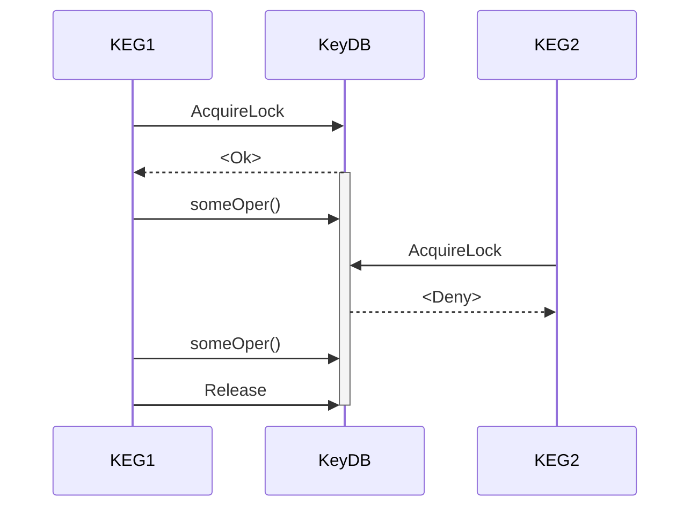
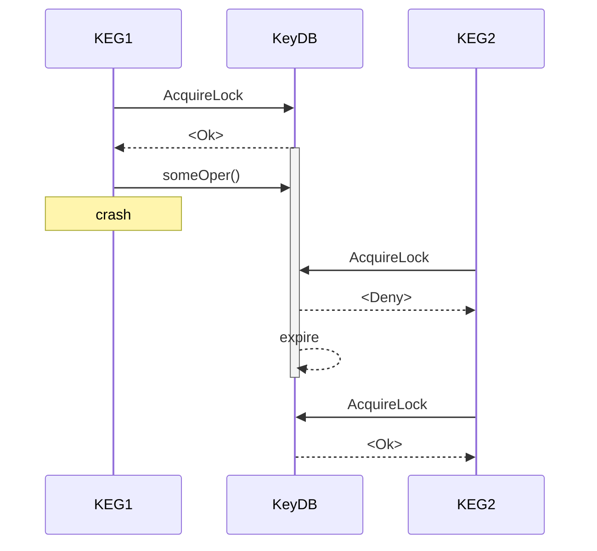

# keg
Key Generator
## API
<details>
 <summary><code>GET</code> <code><b>/v1/key</b></code> <code>(gets unique key)</code></summary>

##### Responses

> | http code     | content-type                      | response                                                            |
> |---------------|-----------------------------------|---------------------------------------------------------------------|
> | `201`         | `application/json`        | {"data":{"key":"12ab"}}                                            |

##### Example cURL

> ```bash
> curl -v -XGET -H "Content-type: application/json" localhost:8080/v1/key
> ```

</details>

<details>
 <summary><code>DELETE</code> <code><b>/v1/key/{key}</b></code> <code>(deletes key from used database)</code></summary>

##### Parameters

> | name              |  type     | data type      | description                         |
> |-------------------|-----------|----------------|-------------------------------------|
> | `key`             |  required | string         | Key to delete        |

##### Responses

> | http code     | content-type                      | response                                                            |
> |---------------|-----------------------------------|---------------------------------------------------------------------|
> | `204`         | `application/json`        |                                                                     |
> | `404`         | `application/json`        | {"error":"not found"}                                               |

##### Example cURL

> ```bash
> curl -v -XDELETE -H "Content-type: application/json" localhost:8080/v1/key/12ab
> ```

</details>

## Key Database
Application uses [KeyDB](https://docs.keydb.dev/) (fork of [Redis](https://redis.io/)) to store prerendered keys. It caches about 100 keys in memory to reduce number of db calls.
### Keys
Keys are prerendered and stored in database with ".avail" suffix. After batch of keys are fetched from database they are renamed to have ".used" suffix.
Once key is expired / deleted it is once again renamed to have avail suffix.
### Expiring Lock
To allow multiple instances to access same database, app uses expiring lock mechanism, which also prevents indefinite lock in case of app crash while performing db operations.

Second instance might get batch of same keys as first before they are renamed as used. Lock prevents such situation.

Since lock is expiring, in case of app crash, it will be released after timeout, so working instances will not be blocked indefinitely.

