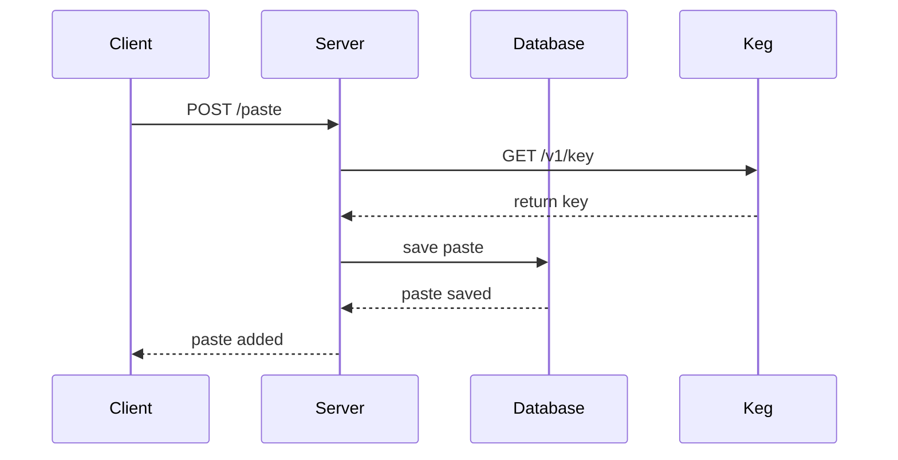

# Server
BasedBean Server
## API
<details>
 <summary><code>POST</code> <code><b>/login</b></code> <code>(log user)</code></summary>

##### Request data

> | content-type                      | data                                                                |
> |-----------------------------------|---------------------------------------------------------------------|
> | `application/json`                | {"user":"Clark", "password":"Kent"}                  |

##### Responses

> | http code     | content-type                      | response                                                            |
> |---------------|-----------------------------------|---------------------------------------------------------------------|
> | `200`         | `application/json`                | {"tokan":"ascrt34gqas"}                                             |
> | `401`         | `application/json`                | {"info":"Invalid login or password."}                               |

</details>

<details>
 <summary><code>POST</code> <code><b>/register</b></code> <code>(register user)</code></summary>

##### Request data

> | content-type                      | data                                                                |
> |-----------------------------------|---------------------------------------------------------------------|
> | `application/json`                | {"user":"Clark", "password":"Kent"}                  |

##### Responses

> | http code     | content-type                      | response                                                            |
> |---------------|-----------------------------------|---------------------------------------------------------------------|
> | `201`         | `application/json`                | {"info":"User added successfully"}                                  |
> | `400`         | `application/json`                | {"info":"User already exist."}                                      |

</details>

<details>
 <summary><code>POST</code> <code><b>/paste</b></code> <code>(add paste)</code></summary>

##### Request header data

> | header name                       | data                                                                |
> |-----------------------------------|---------------------------------------------------------------------|
> | `authorization`                   | "Bearer {token}"                                                    |

If authorization header is not provided paste will be created as guest and removed after 7 days.

##### Request data

> | content-type                      | data                                                                |
> |-----------------------------------|---------------------------------------------------------------------|
> | `application/json`                | {"text":"paste content, "title":"paste title"}                      |

##### Responses

> | http code     | content-type                      | response                                                            |
> |---------------|-----------------------------------|---------------------------------------------------------------------|
> | `201`         | `application/json`                | {"info": "Paste added successfully."}                               |

</details>

<details>
 <summary><code>GET</code> <code><b>/paste/{key}</b></code> <code>(get paste)</code></summary>

##### Parameters

> | name              |  type     | data type      | description                         |
> |-------------------|-----------|----------------|-------------------------------------|
> | `key`             |  required | string         | Paste key                           |

##### Responses

> | http code     | content-type                      | response                                                            |
> |---------------|-----------------------------------|---------------------------------------------------------------------|
> | `200`         | `application/json`                | {"text": "paste content", "title":"paste title"}                    |
> | `400`         | `application/json`                | {"info": "Invalid key."}                                            |

</details>

<details>
 <summary><code>DELETE</code> <code><b>/paste/{key}</b></code> <code>(delete paste)</code></summary>

##### Request header data

> | header name                       | data                                                                |
> |-----------------------------------|---------------------------------------------------------------------|
> | `authorization`                   | "Bearer {token}"                                                    |

##### Parameters

> | name              |  type     | data type      | description                         |
> |-------------------|-----------|----------------|-------------------------------------|
> | `key`             |  required | string         | Paste key                           |

##### Responses

> | http code     | content-type                      | response                                                            |
> |---------------|-----------------------------------|---------------------------------------------------------------------|
> | `200`         | `application/json`                | {"info": "Paste deleted successfully."}                             |
> | `400`         | `application/json`                | {"info": "Invalid key."}                                            |
> | `401`         | `application/json`                | {"info": "Inactive session."}                                       |

</details>

<details>
 <summary><code>GET</code> <code><b>/user/pastes</b></code> <code>(get list of pastes created by user)</code></summary>

##### Request header data

> | header name                       | data                                                                |
> |-----------------------------------|---------------------------------------------------------------------|
> | `authorization`                   | "Bearer {token}"                                                    |

##### Responses

> | http code     | content-type                      | response                                                                                |
> |---------------|-----------------------------------|-----------------------------------------------------------------------------------------|
> | `200`         | `application/json`                | {"pastes": [{"key":"1", "title":"first paste"}, {"key":"2", "title":"second paste"}]}   |
> | `401`         | `application/json`                | {"info": "Inactive session."}                                                           |

</details>

<details>
 <summary><code>DELETE</code> <code><b>/expiry</b></code> <code>(delete all outdated guest pastes)</code></summary>

##### Responses

> | http code     | content-type                      | response                                               |
> |---------------|-----------------------------------|--------------------------------------------------------|
> | `200`         | `application/json`                | {"info":"Expiry run successfully."}                    |

</details>

## Architecture

Server is connected to database and Keg (Key Generator) microservice. Below flow chart shows interworking between components in example of paste addition. The operation is analogous for key removal.



## .env

Server works with following environmental variables:

```dosini
MONGODB_SCHEME=
MONGODB_PORT=
MONGODB_IP=
KEG_SCHEME=
KEG_PORT=
KEG_IP=
SERVER_PORT=
SERVER_IP=
JWT_SECRET=
```