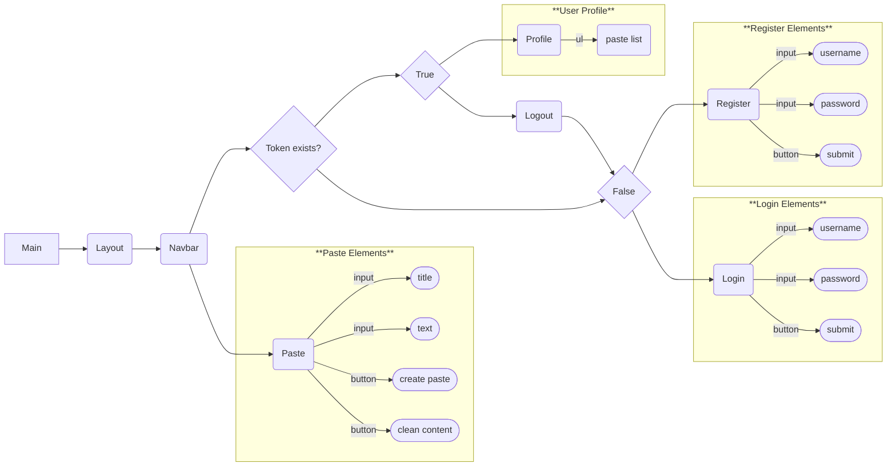

# Frontend

Vite + React + TypeScript

# Components

<details>
 <summary><code>Register</code></summary>

##### Elements

> | user-inputs    | content              | allowed-characters                       | length-rule                       |
> | -------------- | -------------------- | ---------------------------------------- | --------------------------------- |
> | user-field     | <code>string </code> | <code>/^[A-Za-z0-9-_]+</code>            | <code>3 < user.length < 20</code> |
> | password-field | <code>string </code> | <code>/[A-Z]+/;/[a-z]+/;/[0-9]+/;</code> | <code>6 < password.length</code>  |

> | user-interactable | onClick-event                  | successful <code>201</code> | not successful <code>400</code>          |
> | ----------------- | ------------------------------ | --------------------------- | ---------------------------------------- |
> | submit-button     | <code>submitCredentials</code> | navigate user to login      | pop-up <code>"User already exist"</code> |

</details>

<details>
<summary><code>Login</code></summary>

##### Elements

> | user-inputs    | content              | allowed-characters                       |
> | -------------- | -------------------- | ---------------------------------------- |
> | user-field     | <code>string </code> | <code>/^[A-Za-z0-9-_]+</code>            |
> | password-field | <code>string </code> | <code>/[A-Z]+/;/[a-z]+/;/[0-9]+/;</code> |

> | user-interactable | onClick-event           | successful <code>200</code>  | not successful <code>401</code>                 |
> | ----------------- | ----------------------- | ---------------------------- | ----------------------------------------------- |
> | submit-button     | <code>submitForm</code> | navigate user to clean paste | pop-up <code>"Invalid login or password"</code> |

</details>

<details>
<summary><code>Paste</code></summary>

##### Elements

> | user-inputs | content              |
> | ----------- | -------------------- |
> | title-field | <code>string </code> |
> | text-field  | <code>string </code> |

> | user-interactable | onClick-event           | successful <code>201</code> | not successful                        |
> | ----------------- | ----------------------- | --------------------------- | ------------------------------------- |
> | create-button     | <code>submitForm</code> | saved paste in database     | pop-up <code>"Paste not saved"</code> |
> | clean-button      | <code>submitForm</code> | cleaned text-field          | always successful                     |

</details>

<details>
<summary><code>Profile</code></summary>

##### Elements

> | user-interactable       | onClick-event            | successful <code>200</code> | not successful <code>400</code> |
> | ----------------------- | ------------------------ | --------------------------- | ------------------------------- |
> | pastelist-title-button  | <code>loadPaste</code>   | saved paste in database     |                                 |
> | pastelist-delete-button | <code>removePaste</code> | removed paste from database |                                 |

</details>

# Structure



# .env

Interacting with server requires environmental variables:

```dosini
VITE_SERVER_IP=
VITE_SERVER_PORT=
```
